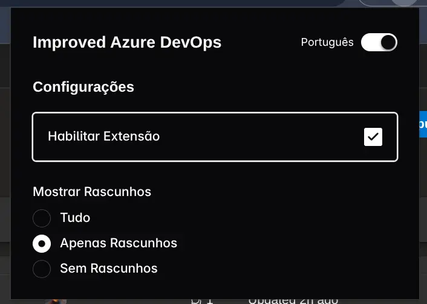

# IMPROVED AZURE DEVOPS

A chrome extension that tweaks Azure Devops UI

## Features

- Filter Draft PRs
- Fully local

## Installation

### Via github releases

- Download the latest release from the [releases page](https://github.com/devlulcas/improved-azure-devops-extension/releases) and extract the zip file.
- Open Chrome and navigate to `chrome://extensions/`.
- Enable Developer Mode.
- Click on `Load unpacked` and select the extracted folder.

### Via local development

- Install node.js and pnpm.
- Clone the repository.
- Run `pnpm install` to install the dependencies.
- Run `pnpm build` to build the extension.
- Open Chrome and navigate to `chrome://extensions/`.
- Enable Developer Mode.
- Click on `Load unpacked` and select the `dist` folder.

## How to contribute?

- Make a PR.

You can fix bugs, add features, improve the code, etc.

## License

MIT

> Do what you want with it.
